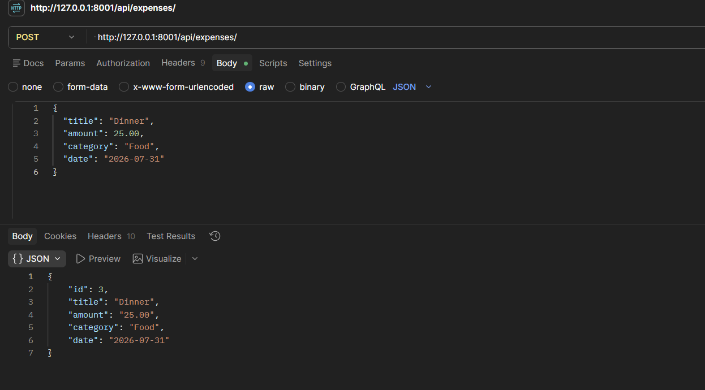
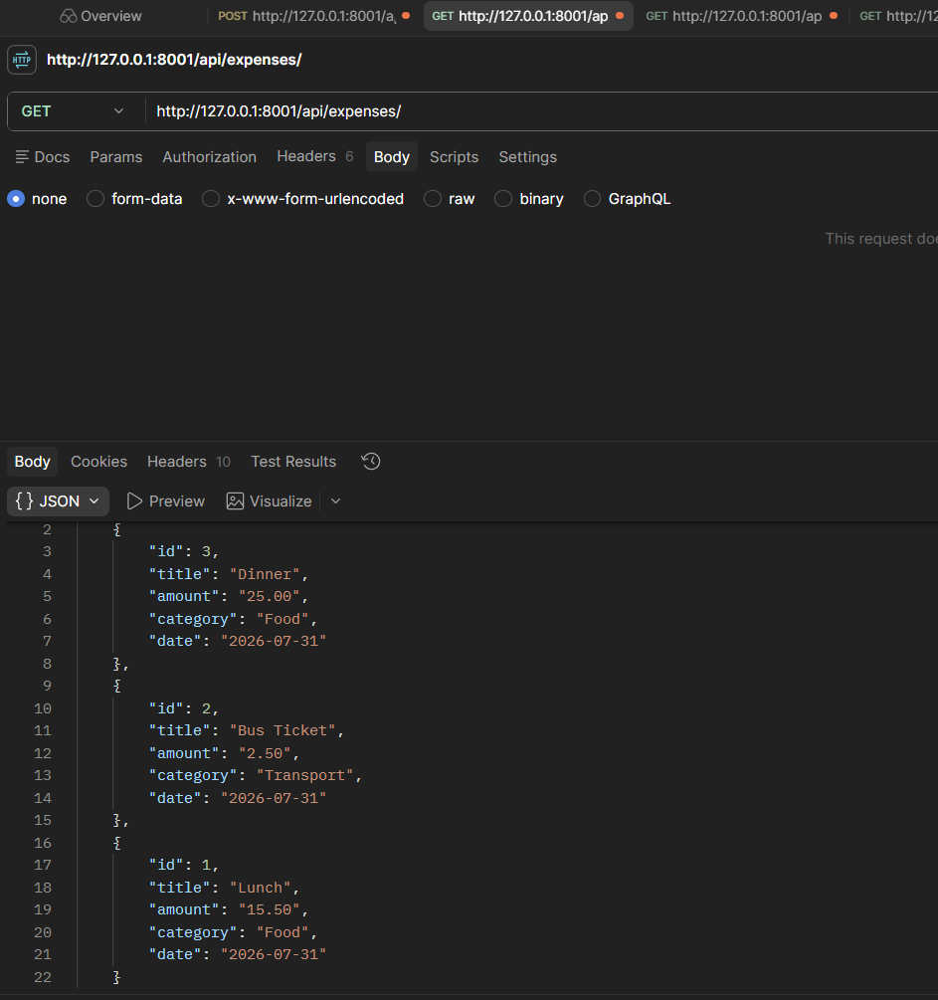
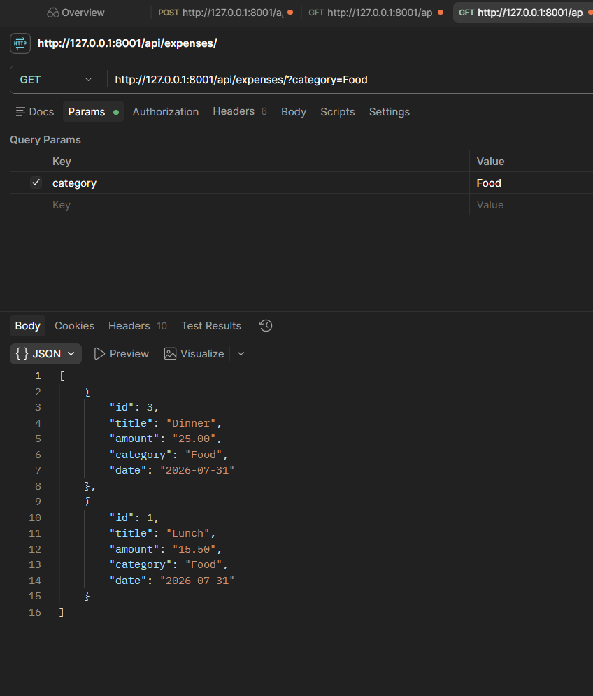
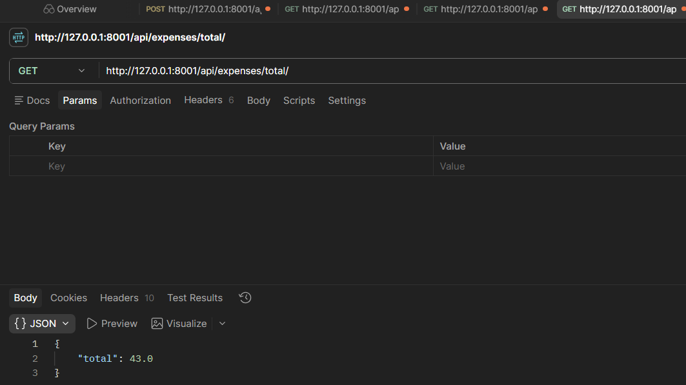
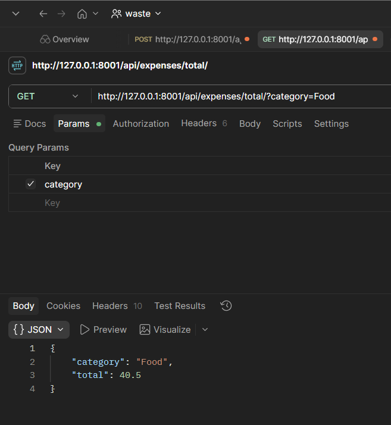
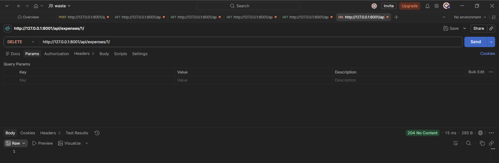

# 💰 Smart Expense Tracker API


A REST API built using **Django REST Framework** to manage personal expenses. It supports creating, viewing, filtering, calculating totals, and deleting expenses.

---

## ✨ Features

- ➕ Add Expense
- 📄 View All Expenses
- 📂 Filter by Category
- 📊 Calculate Total Expenses
- 🗑️ Delete Expense
- ✅ Input Validation
- 🧪 Automated Tests

---

## 🛠 Tech Stack

- Python
- Django
- Django REST Framework
- SQLite
- Postman

---

## 📁 Project Structure

```text
Diligent_Assignment/
├── README.md
├── AI_NOTES.md
├── requirements.txt
├── Expense_Tracker_API.postman_collection.json
├── Output_Images/
├── src/
└── tests/
```

---

## 🚀 Installation

Clone the repository

```bash
git clone https://github.com/dj-ayush/Diligent_Assignment.git
cd Diligent_Assignment
```

Create a virtual environment

```bash
python -m venv venv
```

Activate it

### Windows

```bash
venv\Scripts\activate
```

### Linux / macOS

```bash
source venv/bin/activate
```

Install dependencies

```bash
pip install -r requirements.txt
```

---

## ▶️ Run the Server

```bash
cd src
python manage.py migrate
python manage.py runserver
```

Server:

```text
http://127.0.0.1:8000/
```

---

## 🧪 Run Tests

```bash
cd src
python manage.py test
```

---

## 📬 API Testing (Recommended)

For the easiest evaluation, use the included **Postman Collection**.

Import the following file into Postman:

```text
Expense_Tracker_API.postman_collection.json
```

Run the requests in the following order:

```http
POST    /api/expenses/
GET     /api/expenses/
GET     /api/expenses/?category=Food
GET     /api/expenses/total/
GET     /api/expenses/total/?category=Food
DELETE  /api/expenses/<id>/
```

---

## 📸 Sample Output

### ➕ Create Expense



---

### 📄 View All Expenses



---

### 📂 Filter by Category



---

### 📊 Total Expenses



---

### 📊 Total Expenses by Category



---

### 🗑️ Delete Expense



---

## ✅ Reviewer Notes

For a quick evaluation:

- Install the project using the commands above.
- Run the Django development server.
- Import the provided **Postman Collection**.
- Execute the API requests.
- Compare the responses with the screenshots above.

All required assignment features have been implemented, manually tested, and covered with automated tests.
